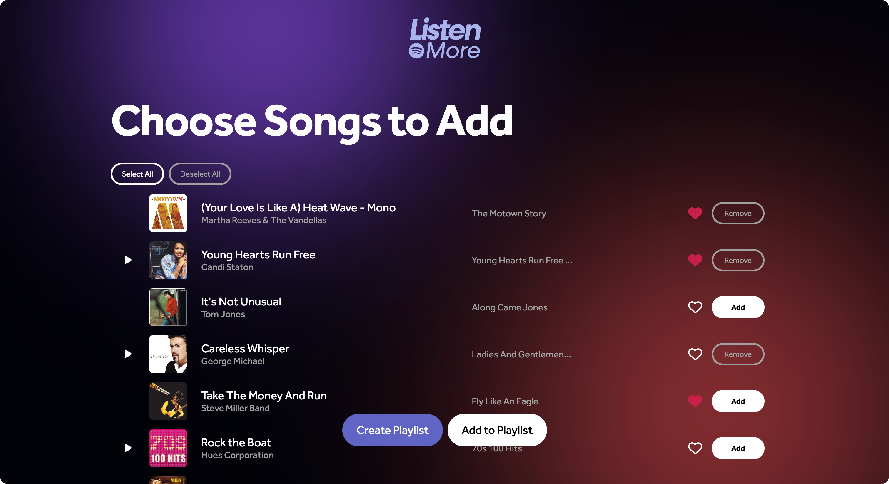

<div align="center">
    

  <h1 align="center">ListenMore - A Spotify Powered Playlist Generator</h1>

  <p align="center">
    ListenMore is a web application where users can select one of their personal playlists as a template and set desired levels of valence, energy, and danceability to curate a customized playlist.
  </p>
</div>


## About The Project



As my music library grew, I found it increasingly time-consuming to manually create entirely new playlists. Each time I wanted to discover new tracks or create a playlist with a specific vibe, I'd spend hours searching for the right songs, which sometimes took the joy out of the process.

That's why I created ListenMore. This app allows users to select one of their existing playlists as a base and adjust parameters such as valence, energy, and danceability to quickly generate a new playlist. Now, you can easily create the ideal playlist for any occasion without the hassle of manual searching. This app brings back the joy of discovering and enjoying music, tailored perfectly to your preferences.


### Tech Stack

**Front-end:**             	

**Back-end:**    

**Other:** Spotify Web API


### How it Works

- **1. Select Base Playlist**: The Spotify API loada in the user's existing playlists so that they can choose one to base the new playlist on.
- **2. Set Preferences**: The user can then adjust the valence, energy, and danceability parameters to tailor the new playlist to your mood and preferences.
- **3. Generate New Music**: The program calculates the most common artists and genres in the selected playlist, and uses that info along with the set preferences to generate 50 new song suggestions using Spotify's Song Recommendation API.

- **4. Add Music**: The user can then add the generated songs to their liked songs, create a new playlist, or add to an existing playlist.


## Getting Started

### Installation

1. Clone the repository:
    ```sh
    git clone https://github.com/DoyoonKim24/ListenMore.git
    cd ListenMore
    ```

2. Install the server-side dependencies:
    ```sh
    cd server
    npm install
    ```

3. Install the client-side dependencies:
    ```sh
    cd ../client
    npm install
    ```

4. Set up your Spotify Developer credentials:
    - Create a new application on the [Spotify Developer Dashboard](https://developer.spotify.com/dashboard/applications).
    - Note down your Client ID and Client Secret.
    - Set the Redirect URI to `http://localhost:8888/callback`.

5. Configure the server:
    - Create a `.env` file in the `server` directory and add the following:
      ```env
      CLIENT_ID=your_spotify_client_id
      CLIENT_SECRET=your_spotify_client_secret
      ```

### Running the Application

1. Start the Express server:
    ```sh
    cd server
    npm start
    ```

2. Start the React app:
    ```sh
    cd ../client
    npm start
    ```
